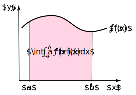

# pandoc-svg

A [Pandoc](https://pandoc.org/index.html) [filter](https://pandoc.org/filters.html) that enables usage of Pandoc's Markdown in SVG `<text>` elements (see demos below). This is particularly useful for SVGs containing math.

Currently, **only HTML output is supported**, but PDF/LaTeX support is in the works. Other output formats (such as DOCX) could be supported by converting the SVG to a raster graphics format. If you have a need for this, please open an issue!

For HTML output, pandoc-svg **optimizes SVGs** (using [SVGO](https://github.com/svg/svgo) as well as some custom algorithms) and **inlines SVGs** in the HTML output for **greater page load speed**. Furthermore, pandoc-svg converts some elements of the [SVG 2](https://www.w3.org/TR/SVG2/) specification to their [SVG 1.1](https://www.w3.org/TR/SVG11/) equivalents so that they can be rendered correctly by browsers. This allows inclusion of SVGs generated by [Inkscape](https://inkscape.org/) (which use SVG 2 features) without post-processing.




If you have an intriguing example SVG that you would like to share, please open an issue, and I'll add it here.


## Known limitations

All known current limitations are listed below:

- For the time being, only HTML output is supported.

- Currently, if the file path of the SVGs is relative, it must be specified **relative to the directory from which Pandoc is executed**. This limitation is due to [this issue](https://github.com/jgm/pandoc/issues/8492) and will hopefully soon be removed.

- At the moment, pandoc-svg has no way of knowing what options Pandoc was executed with. Therefore, no other math output options apart from [MathJax](https://www.mathjax.org/) are available (such as [KaTeX](https://katex.org/)). This limitation can be removed once the above issue is resolved.

- For HTML output, conversion from SVG 2 to SVG 1.1 is very crude at the moment. All it currently does is replace the marker style attributes `fill:context-stroke` and `stroke:context-stroke` with `fill:#000` and `stroke:#000` respectively. This results in incorrect marker/arrow colors, unless they are meant to be black. If an element of your SVG displays incorrectly in the browser, please open an issue and I will try to fix it.


## Installation

``` console
git clone https://github.com/rnwst/pandoc-svg.git
cd pandoc-svg
npm link
```
I don't like to install npm packages system-wide, since this requires superuser privileges. To install the package user-wide instead, configure npm (before running `npm link`) to use the directory `~/.local/` for global installation of npm packages (this adds the line `prefix=~/.local/` to your `~/.npmrc`):
``` console
npm config set prefix '~/.local/'
```
Make sure that `~/.local/bin` exists and add it to the `PATH` (replace `~/.shellrc` with the configuration file of the shell you are using, such as `~/.bashrc`):
``` console
mkdir -p ~/.local/bin
echo 'export PATH=~/.local/bin/:$PATH' >> ~/.shellrc
```

## Usage

The filter can be invoked as follows:
``` console
pandoc input-file.pdc -o output-file.html -f markdown -t html --filter pandoc-svg
```
If an SVG contains math, the [defaults file](https://pandoc.org/MANUAL.html#defaults-files) below needs to be provided to Pandoc by appending `--defaults=defaults.yaml` to the above command (alternatively, the `math` variable can also be set in the document's metadata or via the command line).

`defaults.yaml`:
``` html
variables:
  math: |
    <script>
      MathJax = {
        startup: {
          ready() {
            MathJax._.core.MmlTree.MmlNodes.math.MmlMath.defaults.scriptminsize = '6pt';
            MathJax.startup.defaultReady();
          }
        }
      }
    </script>
    <script
     async
     src="https://cdn.jsdelivr.net/npm/mathjax@3/es5/tex-svg-full.js">
    </script>
```
The `math` variable needs to be set if your document [contains no math other than inside SVGs](https://github.com/jgm/pandoc/issues/8469). Furthermore, MathJax's `scriptminsize` value needs to be set to avoid [this sizing issue](https://github.com/mathjax/MathJax/issues/2975).

### Positioning of Markdown

SVG `<text>` elements are positioned via an [anchor](https://developer.mozilla.org/en-US/docs/Web/SVG/Attribute/text-anchor) whose position is either start, middle, or end-of-baseline (shown by a small hollow square in Inkscape). To change the anchor position from start-of-baseline to one of the two other possible values, use the text-alignment tool: &nbsp; .

### Inlining SVGs in HTML

By default, for HTML output, pandoc-svg inlines SVGs to increase page load speed (since no separate requests need to be made to retrieve the SVGs). If an SVG is particularly large, it may be undesirable to inline it, since it would increase the time to load the HTML file (even though the total load time would be slightly reduced). In that case, pandoc-svg can be disabled for an individual SVG by adding the class `ignore` to it:
``` markdown
{.ignore}
```
Note that this will disable all of pandoc-svg's functionality for this SVG, i.e. resizing and MathJax formulas won't work.

### Controlling SVG dimensions

***TLDR*: pandoc-svg scales SVGs so that elements of size 12&thinsp;pt/16&thinsp;px become the same size as the font size of the text that surrounds the SVG. This behavior can be disabled.**

When creating the SVG (using an editor such as Inkscape), care must be taken to size elements appropriately for the context the SVG is going to appear in (i.e. the rest of the HTML page). pandoc-svg simplifies this process by automatically scaling the SVG so that elements of size 12&thinsp;pt/16&thinsp;px (as set in the SVG editor) become the same size as the font size of the surrounding text. pandoc-svg does this by scaling the SVG from the [absolute units](https://developer.mozilla.org/en-US/docs/Learn/CSS/Building_blocks/Values_and_units) the editor usually dimensions it in to the appropriate relative size in `em` units, where 12&thinsp;pt equals 1&thinsp;em. This has the advantage that the size of the SVG is always adjusted to the size of the surrounding text it appears in.

This behavior can be disabled by adding the class `keep-size` to the SVG:
``` markdown
{.keep-size}
```
In addition, a custom scale factor can be supplied for the SVG. This can be used to change the SVG's size without modifying it. The SVG is still dimensioned in relative units, thus it will change size if the `font-size` of its parent element changes.
``` markdown
{scale-factor=1.5}
```

To maintain compatibility with pandoc, pandoc-svg also allows sizing of SVGs using the [`width` and `height` attributes](https://pandoc.org/MANUAL.html#extension-link_attributes):
``` markdown
{width=2in}
```
As for Pandoc, the unit identifiers `px`, `cm`, `mm`, `in`, `inch`, and `%` can be used. Specifying either `width` or `height` overrides `scale-factor` or `keep-size`.


## Miscellaneous

### Understanding SVG sizing

Below follows a brief explanation of how SVG sizing works, for those who are interested. **One does not need to understand this to be able to use pandoc-svg.**

Dimensions inside of an SVG are specified using [*user units*](https://www.w3.org/TR/SVG/coords.html), which are dimensionless. If a *style* attribute is used inside the SVG, the unit identifier is 'px', since CSS requires the presence of a unit identifier. The 'SVG style attribute px' is defined to be equal to one *user unit*. It is important to note that the ***user unit* (or 'SVG style attribute px') does not correspond to a 'px' in your HTML file**! The relation beteween the SVG *user unit* and units in the HTML file is set using the `<width>`, `<height>`, and `<viewBox>` attributes. The `<width>` and `<height>` attributes are in [CSS units](https://developer.mozilla.org/en-US/docs/Learn/CSS/Building_blocks/Values_and_units) (when no unit identifier is present, the unit is CSS `px`), and the `<viewBox>` attribute is in *user units*. In the following example, one *user unit* equals `2mm`:
``` xml
<svg
 xmlns="http://www.w3.org/2000/svg"
 width="30mm"
 height="20mm"
 viewBox="0 0 15 10">  <!-- `width` and `height` are in 'real units'
                                whereas `viewBox` is in *user units* -->
  <!--
     Pretty shapes go here, which are dimensioned in user units.
     If a style tag is used, the CSS unit identifier must be 'px'.
  -->
</svg>
```


## License

© 2022 R.&thinsp;N. West. Released under the [GPL](https://www.gnu.org/licenses/old-licenses/gpl-2.0.html) version 2 or greater. This software carries no warranty of any kind.
